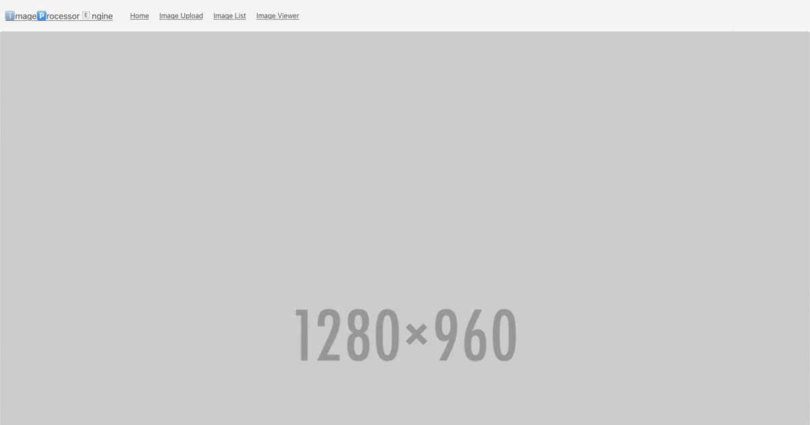

About
=====
This mini-project is written to demonstrate an Image management engine built using
the following technologies.

Frontend
- Bootstrap4(HTML+ CSS), Jquery

Backend
- Django framework, Redis, Postgres(DB) and Celery
- Nginx(Webserver)

Infrastructure
- Dockerized application deployed on Minikube.

Design Choices and recommendations
==================================

Storing images in the DB
------------------------
Storing images in the DB directly as byte data can work. But overtime, the size of the DB
grows out of control.
To remedy this situation, we can opt for an object store then in our database we could simply
reference the public url of the image.

For this mini-project, we will not deploy an object store on minikube using open source 
solutions like Minio/Rook.
Instead, we could mount a simple persistent volume on disk then use it to store uploaded images.

Click manager
-------------
We are required to update the status of each photo in the Image Viewer tab as users scroll to and fro while accepting or rejecting images.

This implies our database writes for every click. This will not scale if you have millions of 
clicks a second. 
Alternatively, we can send the individual accept or deny requests as messages then queue them using
Celery periodic tasks which will be executed sometime in future.

Drawbacks
=========
- It is good practice to implement the frontend as a standalone application using frameworks
such as ReactJs or Vue.
For simplicity sake, this exercise will use basic html and css wrapped with bulma(a css framework)
with some Javascript implemented with old-school Jquery.

- Only a limited set of backend testing has been done. We should consider implementing frontend and backend tests. See `imageProcessor/tests` directory for more

- We also need to monitor the entire cluster. This mini-project does not deploy a monitoring stack
along side our setup.

- No persistent volume for Redis has been added. For persisting redis config data, we might require to add
a storage volume.

How to run this project
=======================
Requirements
------------

- Install minikube on a Linux based system following these [steps](https://minikube.sigs.k8s.io/docs/start/)

- From the terminal, start the clutser using `minikube start`

- Ensure `kubectl` is installed, if not, follow this [manual](https://v1-18.docs.kubernetes.io/docs/tasks/tools/install-kubectl/) to install it.

- To validate that the installation of Kubectl above is complete, run the following command. `kubectl version`.

- Finally, check the status of your minikube cluster using `kubectl cluster-info`.

Deploying services
------------------
Our mini-project relies on the following services to function; Celery, redis and Postgresql.

In this section, we will describe how to deploy each of these services ontop of Minikube.
In the deployment directory, you will find Deployment manifests for each of the above services.

1. Create a service namespace for our stack.

    `kubectl create namespace imageProcessor`

2. Deploy redis

    In the deployment redis directory, run the following command:
    - `kubectl apply -f deployment/redis`

    Confirm that you have a running redis deployment in the `imageprocessor` namespace using `kubectl get pods -n imageprocessor`

3. Deploy PostgreSQL

    In the deployment postgres directory, run the following command:
    - `kubectl apply -f deployment/postgres`

4. Deploy celery

    In the deployment celery directory, run the following commands:
    - `kubectl apply -f deployment/celery`

5. Deploy Django backend

    In the deployment django directory, run the following commands in order:
    - `kubectl apply -f deployment/django/service.yml`
    - `kubectl apply -f deployment/django/migration.yml`
    - `kubectl apply -f deployment/django/deployment.yml`

Finally, verify that all pods in the `imageprocessor` namespace are running using:
`kubectl get pods -n imageprocessor`.

Build
=====
This mini-project docker image has been hosted on Dockerhub for ease of use.
Alternatively, you can build it locally from the project root directory containing
the dockerfile

`docker build -t imageprocessor .`

Test
====
This mini-project includes an example test-suite for some models and views.

To run test, in a virtual environement with all dependencies installed,
execute the following command:

`python manage.py test`

Access the application
======================

To access the deployed application, use the following command:

`minikube service --url kubernetes-django-service -n imageprocessor`

The above command should expose our webapplication using a Nodeport.
Obtain the URL and place it in a browser page.

To see health status of the Django stack components, visit this url,
`http://<url-from-above>/healthcheck`

Django admin default login credentials are as follows:
`username: admin` `password: password`

Screenshots
===========

